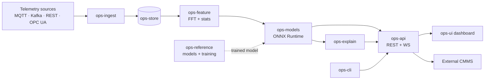
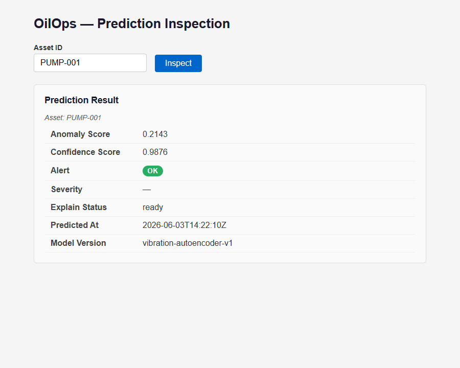
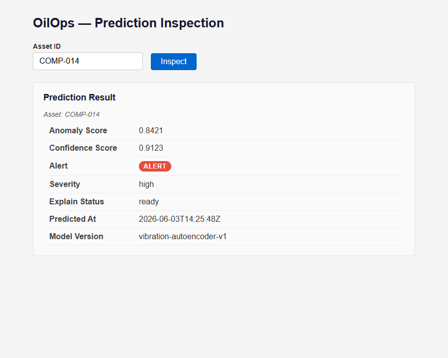

# OilOps-PredictiveCore

[](https://github.com/rubensrudio/OilOps-PredictiveCore/actions/workflows/ci.yml)
[](LICENSE)
[](https://www.python.org/)
[](https://angular.io/)
[](docs/PRD_OilOps-PredictiveCore.md)
[](#release)

> **Predictive operational intelligence engine for the U.S. energy industry.**
> A portable, vendor-neutral, self-hostable predictive-maintenance layer for
> small and medium operators who lack an in-house data-science team.

> ⚠️ **Advisory-only (RN-06).** This system is **not safety-rated** and is not
> certified for safety-instrumented functions (SIL). Predictions must not be the
> sole basis for safety-critical decisions. Every API response carries
> `X-Advisory-Only: true`. See [`NOTICE`](NOTICE).

> 🚧 **Project status — honest disclosure.** This is an **early-stage prototype
> under active development (Phase 1)**. The repository contains the core
> architecture, the ingestion/serving contracts, and **one** working reference
> model (rotating-equipment vibration). The two other reference models
> (pump cavitation, pipeline pressure) are roadmapped, not yet built. The
> [PRD](docs/PRD_OilOps-PredictiveCore.md) describes the full v1 vision; this
> README documents what is actually implemented today.

---

## Why this exists

ABB's 2025 survey puts unplanned downtime in process industries at **US $125,000
per hour**. AI-driven predictive maintenance is one of the highest-ROI digital
interventions in the sector — but adoption is concentrated among integrated
majors with dedicated data-science teams. Smaller operators, the most exposed to
downtime cost, are the least equipped to deploy the technology that reduces it.

OilOps-PredictiveCore targets that gap: standard telemetry in, explainable
anomaly predictions out, deployable on the operator's own infrastructure with no
SCADA-vendor lock-in.

---

## Architecture



Full diagrams (service topology + prediction sequence) and the API surface are in
**[docs/ARCHITECTURE.md](docs/ARCHITECTURE.md)**.

| Service | Responsibility | Stack |
|---|---|---|
| `ops-ingest` | Telemetry intake → canonical schema | FastAPI |
| `ops-store` | Time-series persistence (pluggable) | FastAPI |
| `ops-feature` | Windowing, statistical + FFT features | Python |
| `ops-models` | Model serving (fixed ONNX contract) | ONNX Runtime |
| `ops-explain` | Feature attribution (async) | Python |
| `ops-api` | REST + WebSocket gateway, advisory middleware | FastAPI |
| `ops-cli` | Operator CLI | Python |
| `ops-ui` | Read-only operator dashboard | Angular 17 |
| `ops-reference` | Reference models, datasets, training pipelines | scikit-learn / ONNX |

---

## Screenshots

The `ops-ui` read-only **Prediction Inspection** view — query an asset, get its
current anomaly/confidence scores, alert state, severity, and model version.

| No anomaly (OK) | Anomaly detected (ALERT) |
|---|---|
|  |  |

---

## Reference model metrics

`vibration-autoencoder-v1` — rotating-equipment bearing anomaly detector
(PCA reconstruction autoencoder, served as ONNX). Metrics measured on a
hold-out set; source of truth is
[`vibration_autoencoder_v1_metrics.json`](ops-reference/models/vibration_autoencoder_v1_metrics.json).

| Metric | Value | Notes |
|---|---:|---|
| Recall | **1.00** | Recall-first tuning — a missed fault costs more than a false alarm |
| Precision | **0.30** | Synthetic-data baseline; expected to shift on real data |
| F1 | **0.46** | |
| Anomaly threshold | 0.666 | sigmoid(reconstruction-MSE) cutoff |
| Train / test | 128 / 40 | one-class training on normal windows |

These are **synthetic-data baselines, not field performance.** Full
interpretation, provenance, and exact reproduction steps:
**[docs/BENCHMARKS.md](docs/BENCHMARKS.md)**.

---

## Quickstart

**Prerequisites:** Docker + Docker Compose, Python 3.11+, (optional) Node 20 for `ops-ui`.

```bash
# 1. Bring the whole stack up (waits until healthy)
make up

# 2. Smoke-test the gateway
make quickstart        # up + GET /health

# 3. Run the end-to-end demo (telemetry in → prediction out)
./scripts/demo.sh                # Bash / Linux / macOS
pwsh ./scripts/demo.ps1          # Windows PowerShell

# 4. Tear down
make down
```

Other targets: `make test` (pytest across all modules), `make lint` (ruff),
`make train` (regenerate the reference model + metrics).

> Do not expose the stack to the internet without setting `OILOPS_API_KEY`.

---

## Demo

`scripts/demo.sh` / `scripts/demo.ps1` walk the full path:

1. `make up` — start the stack.
2. `GET /health` — fan-out health across services.
3. `POST /telemetry` — push a vibration batch for `PUMP-001`.
4. `GET /predictions/PUMP-001` — read the prediction (note `X-Advisory-Only: true`).
5. `GET /metrics` + `GET /audit` — observability and audit trail.

---

## Reproducibility & external validation

This project is built to be **independently verifiable**, not taken on trust:

- **Continuous integration** — every push/PR runs ruff + pytest across all
  Python modules and builds `ops-ui` via
  [GitHub Actions](.github/workflows/ci.yml) (the **CI** badge above reflects
  live status).
- **Reproducible benchmarks** — the model metrics are regenerated
  deterministically from source with `make train`; the full procedure is in
  [docs/BENCHMARKS.md](docs/BENCHMARKS.md).
- **External dataset provenance** — the reference model is documented against
  the public [CWRU Bearing Dataset](ops-reference/datasets/cwru_sample/README.md);
  problem-domain figures (ABB, DOE, McKinsey, World Bank, US Census) are cited in
  the [PRD](docs/PRD_OilOps-PredictiveCore.md#11-references).

---

## API surface

| Method | Path | Purpose |
|---|---|---|
| `POST` | `/telemetry` | Push a telemetry batch |
| `GET` | `/predictions/{asset_id}` | Current prediction |
| `WS` | `/predictions/stream` | Prediction stream |
| `GET` | `/explain/{prediction_id}` | Feature attribution |
| `POST` | `/models/deploy` | Deploy a model version |
| `GET` | `/health` · `/metrics` · `/audit` | Health, Prometheus metrics, audit log |

---

## Project layout

```
OilOps-PredictiveCore/
├── ops-ingest/      Telemetry ingestion gateway
├── ops-store/       Time-series persistence
├── ops-feature/     Feature engineering (FFT + stats)
├── ops-models/      ONNX model serving
├── ops-explain/     Explainability / attribution
├── ops-api/         REST + WebSocket gateway
├── ops-cli/         Operator CLI
├── ops-ui/          Angular 17 dashboard
├── ops-reference/   Reference models, datasets, training pipelines
├── shared/          Cross-service Pydantic schemas
├── scripts/         demo.sh / demo.ps1
├── docs/            PRD, ARCHITECTURE, BENCHMARKS, screenshots
└── docker-compose.yml · Makefile
```

---

## Release

**v0.1.0 — Phase 1 prototype.** Core architecture, ingestion + serving contracts,
one working reference model (vibration), full CI, reproducible benchmarks, demo.
See the roadmap in the [PRD §8](docs/PRD_OilOps-PredictiveCore.md#8-release-phases).

---

## License

Licensed under the **Apache License 2.0** — see [`LICENSE`](LICENSE) and
[`NOTICE`](NOTICE). Open by design.

Copyright © 2026 Rubens Rudio.
