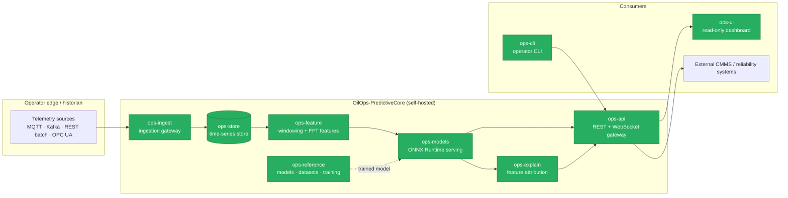
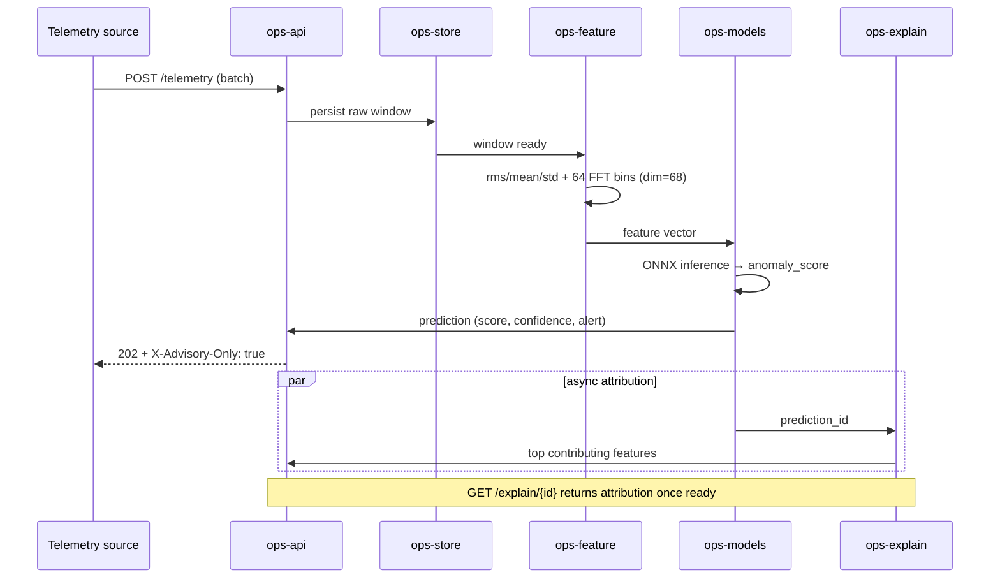

# Architecture

OilOps-PredictiveCore is a containerized, microservices stack. Each service
has a single responsibility and communicates over well-defined contracts. The
full product vision lives in the [PRD](PRD_OilOps-PredictiveCore.md); this
document is the visual + structural reference.

## Service topology

## Prediction data flow

## Services

| Service | Responsibility | Stack |
|---|---|---|
| `ops-ingest` | Telemetry intake; normalize to canonical schema | Python / FastAPI |
| `ops-store` | Time-series persistence (pluggable backend) | Python / FastAPI |
| `ops-feature` | Windowed statistical + frequency-domain features | Python |
| `ops-models` | Model serving over the fixed ONNX contract | Python / ONNX Runtime |
| `ops-explain` | Feature attribution (async to prediction) | Python |
| `ops-api` | Public REST + WebSocket gateway, advisory middleware | Python / FastAPI |
| `ops-cli` | Operator CLI (deploy / train / evaluate / replay) | Python |
| `ops-ui` | Read-only operational dashboard | Angular 17 |
| `ops-reference` | Reference models, datasets, training pipelines | Python / scikit-learn / ONNX |
| `shared` | Cross-service Pydantic schemas | Python |

## API surface (`ops-api`)

| Method | Path | Purpose |
|---|---|---|
| `POST` | `/telemetry` | Push a telemetry batch |
| `GET` | `/predictions/{asset_id}` | Current prediction for an asset |
| `WS` | `/predictions/stream` | Subscribe to the prediction stream |
| `GET` | `/explain/{prediction_id}` | Feature-attribution detail |
| `POST` | `/models/deploy` | Deploy a new model version |
| `GET` | `/health` | Health fan-out across services |
| `GET` | `/metrics` | Prometheus text exposition |
| `GET` | `/audit` | Paginated prediction audit log |

Every response carries `X-Advisory-Only: true` (RN-06).

## Cross-cutting concerns

- **Advisory middleware** — injects `X-Advisory-Only: true` on every response.
- **Tracing middleware** — generates / propagates a `trace_id` via `ContextVar`.
- **Observability** — Prometheus `/metrics`, structured logging, `/audit` trail.
- **Model versioning** — models are versioned in `ops-reference`; rollback supported.
